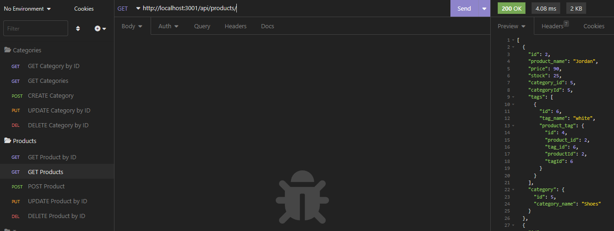

# ecom-backend

[Link to my project](https://github.com/Deiontre10/ecom-backend)
[Link to demo video](https://drive.google.com/file/d/1QDlTi6WIPvhEg9LQQM4t6luK97a_u1Us/view?usp=sharing)

## Table of Contents
- [Description](#description)
- [Visuals](#visuals)

## Description
The Ecom Backend is an ecommerce backend that allows you to get all categories, all products and all tags using GET. Create categories, products and tags using POST. Update categories, products and tags using PUT. Delete categories, products and tags using DEL. It uses sequelize with a MySQL database.

## Visuals

